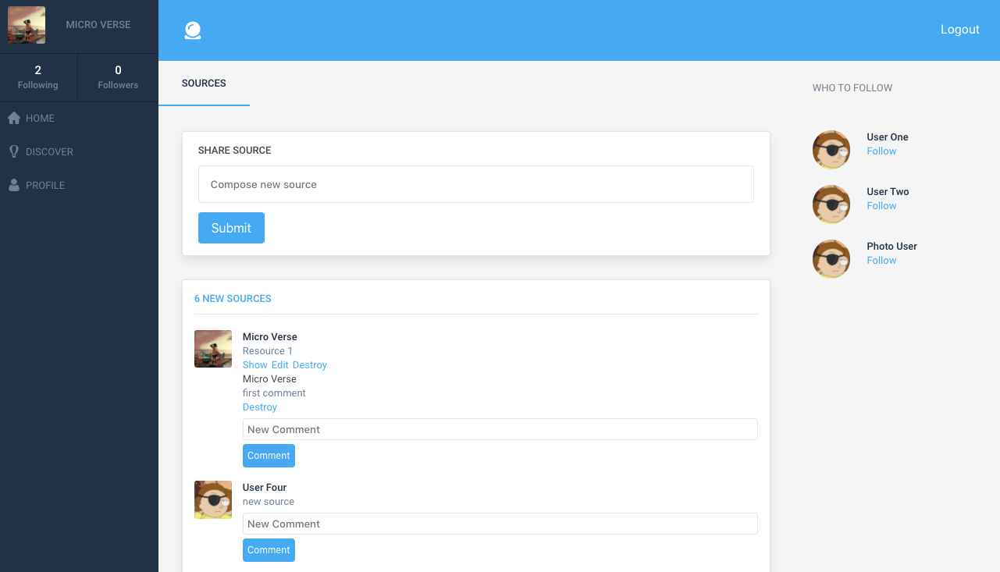

# Twitter Redesign Rails Application

> A Twitter Clone built with Ruby on Rails.

 

## Live Link

To visit the live version of the application visit [this link](https://github.com/m15e) 

## Video Link

To watch a brief video overview of the application 
[click here](https://youtu.be/dEJ0hiJlIDs) 

## Application Features

- Users can sign up to an account
- Users can upload profile pictures and cover photos to their accounts
- Users can login to the app
- Users can create new posts (sources)
- Users can view each other's profiles
- Users can follow/unfollow other users
- Users can comment on each other's posts and delete their comments

## Built With

-   Ruby
-   Ruby on Rails

## Getting Started

To get a local copy up and running follow these simple example steps.

### Prerequisites

1.  Ruby 2.7
2.  Rails 6

### Setup

1.  Clone this repository with
    `git clone https://github.com/m15e/twitter-redesign-rails.git` using your terminal or command line.
2.  Change to the project directory by entering `cd twitter-redesign-rails` in the terminal
3.  Next run `bundle install` to install the necessary dependencies
4.  Run `rails db:migrate` to setup your local database.
5.  Finally run `rails server` to start the application.

## Authors

👤 &nbsp;&nbsp;**Mark Rode**

-   Github: [@m15e](https://github.com/m15e)

## Show your support

Give a ⭐️ if you like this project!

## Acknowledgments

-   The Odin Project
-   Microverse

## 📝 License

This project is [MIT](lic.url) licensed.
